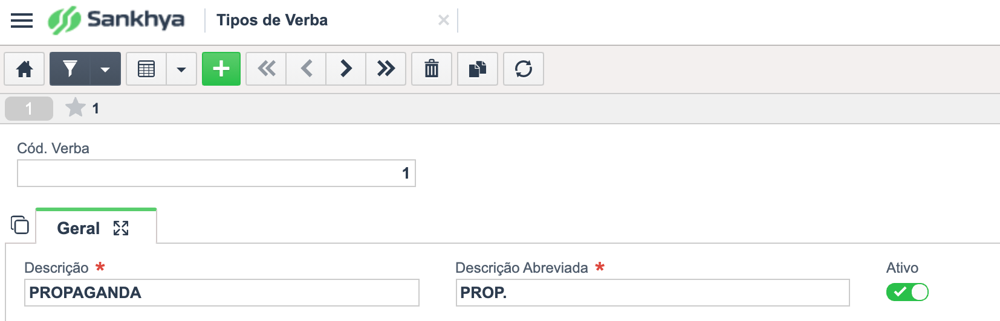
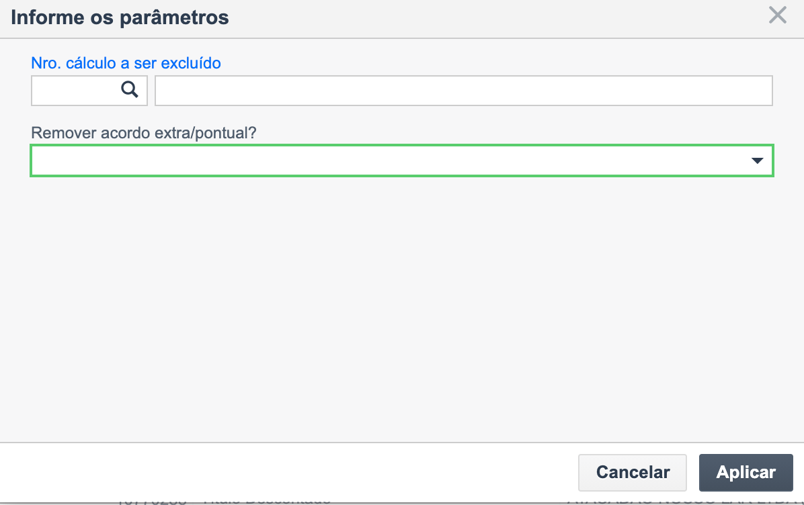
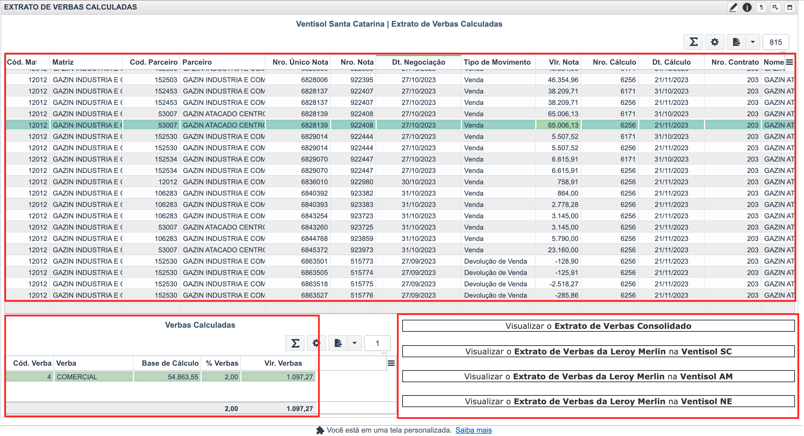

# Módulo de Verbas 

## Informações gerais

* Rotina: Gestão de verbas comerciais
* Setor: Financeiro
* Autor: Duílio Ribeiro
* Data da criação: 21/11/2023

## Descrição

O módulo de verbas foi desenvolvido com o intuito de controlar as verbas comerciais, negociadas entre o grupo Ventisol e seus parceiros. Através dele, todo fluxo de verbas é controlado, desde o cadastro das verbas, gestão dos contratos por parceiro, cálculo de verbas por nota e desconto de verbas nos títulos financeiros.

## Telas/Rotinas
- [Tipos de verba](#menu1)
- [Contratos de verba](#menu2)
- [Cálculo de verbas por nota](#menu3)
- [Desconto de verbas](#menu4)

### Tipos de verba
> Menu: Ventisol >> Cadastros >> Financeiro

#### Descrição
Tela destinada ao cadastro dos tipos de verba que serão vinculados ao contrato do cliente. 
Nesta tela, informamos o código da verba, descrição, descrição abreviada e se está ou não ativa. 
*<u>A descrição abreviada é usada para compor o histórico do desconto no título financeiro.</u>*

[Topo](#menu)

### Contratos de verba
> Menu: Ventisol >> Cadastros >> Financeiro

#### Descrição
Nesta tela é onde toda a gestão dos parâmetros relacionados ao contrato de verba do parceiro. 
Os contratos são vinculados sempre ao parceiro matriz. Nele são definidas as regras gerais e vinculadas todas as verbas negociadas com o parceiro.

#### Aba propriedades
- **Data do contrato:** Data em que o contrato foi efetivamente negociado com o parceiro. 
- **Empresa:** Código da empresa ao qual o contrato está vinculado. 
- **Tipo do contrato:** Aqui estabelecemos a forma como o contrato do cliente terá o seu desconto realizado.
  - **Desconto de verbas no faturamento:** Com esta opção marca, as verbas são calculadas no momento do lançamento da nota. Sendo assim, o financeiro vinculado a nota já é ajustado com o respectivo valor do desconto da verba.
  - **Desconto de verbas no Pagamento:** O desconto será feito através da tela de "Desconto de verbas" e terá seu valor atualizado no respectivo título financeiro.
- **Data inicial e data final do contrato:** Usado para controlar a data de ínicio e fim do contrato de verbas do parceiro.
- **Remover IPI:** Definirá se o IPI irá ou não compor a base de cálculo das verbas.
- **Remover ST:** Definirá se o ST irá ou não compor a base de cálculo das verbas.
- **Remover Frete:** Definirá se o frete irá ou não compor a base de cálculo das verbas.
- **Remover Outras Depesas:** Definirá se outras despesas acessórias iráo ou não compor a base de cálculo das verbas.
- **Remover ICMS:** Definirá se o ICMS irá ou não compor a base de cálculo das verbas.
- **Remover PIS/Cofins:** Definirá se o PIS/Cofins irá ou não compor a base de cálculo das verbas.

#### Aba Verbas
Esta aba contém as verbas que estão associadas ao contrato de verba do parceiro. 
Para adicionar uma verba basta preencher os campos obrigatórios.
- **Verba:** Informe o código da verba será vinculado a este contrato.
- **Tipo de cálculo:** Uma verba pode ser calculada em percentual ou em valor.
- **Percentual:** Deverá ser informado quando o tipo de cálculo da verba estiver definido como percentual.
- **Valor:** Deverá ser informado quanto o tipo de cálculo da verba estiver definido como valor.
- **Fator(Multiplicador):** Este campo é utilizado para realizar a aplicação de um fator de multiplicação para as verbas em valor. Geralmente é usado para inaugurações, etc.
- **Periodicidade:** Define a periodicidade do cálculo da verba.
- **Ignorar no cálculo de verbas por nota:** Define que esta verba não será calculada pela rotina de cálculo automático no faturamento e nem pela tela de cálculos de verba por nota.
- **Desconsiderar a MATRIZ ao considerar/desconsiderar as FILIAIS:** Caso esta marcação esteja efetuada, o sistema irá desconsiderar os valores da matriz em caso de utilização do recurso de desconsiderar as filiais para cálculo de verbas.

##### Outras informações
- **Vigência:** Período de validade da verba.
- **Recorrente:** Se o campo estiver marcado, o período de vigência da verba é considerado para determinar se a mesma será calculada ou não.

##### Filiais que NÃO tem direito a verba
Aqui nesta aba cadastram-se filiais do parceiro matriz que não direito a participar do cálculo de verbas.

##### Filiais que tem direito a verba
Aqui nesta aba cadastram-se filiais do parceiro matriz que tem direito a participar do cálculo de verbas.
> Em caso de não preenchimento, todas as filiais vinculadas a raiz do CNPJ seráo consideradas.

##### Produtos contratados
Aqui nesta aba cadastram-se produtos que iráo participar da composição da base de cálculo da verba.
> Em caso de não preenchimento, todos os produtos negociados pelo parceiro seráo considerados.

##### Produtos NÃO contratados
Aqui nesta aba cadastram-se os produtos que não iráo participar da composição da base de cálculo da verba.

#### Aba de produtos contratados e produtos não contratados.
Assim como as sub-abas de mesmo nome na aba verbas, a funcionalidade é definir ou não produtos que iráo participar da composição da base de cálculo das verbas. 
A diferença neste caso, é que os produtos cadastrados aqui tem abrangência sobre todas as verbas do contrato. Já os que forem cadastrados dentro de cada verba seráo considerados apenas para as verbas em questão.

#### Observação
Destinada a registrar alguma observação pertinente ao contrato. A informação inserida aqui é usada para compor o histórico do título financeiro no momento do desconto da verba.

#### Anexos
Aqui podem ser anexados arquivos diversos pertinentes ao contrato do cliente.

#### Registro de acordo extra/pontual
Através desta aba podemos registrar acordos avulsos negociados pelo setor comercial. Estes acordos geralmente são valores fora do contrato de verbas, que demandam um registro e também uma gestão de saldo e dos descontos efetuados. 
Ao registrar um acordo, o sistema gera automaticamente um número de cálculo, que posteriormente poderá ser utilizado na tela de desconto de verbas. 
A medida que os descontos deste cálculo são efetuados, o valor descontado sofre alterações bem como a coluna de saldo, e os títulos financeiros utilizados no processo de desconto ficam registrados na grade inferior. 
Quando todo o saldo é descontado, a situação do cálculo é atualizada, inibindo que novos descontos sejam efetuados com este número de cálculo.

[Topo](#menu)

### Cálculo de verbas por nota
> Menu: Ventisol >> Rotinas >> Financeiro

Esta tela é destinada ao cálculo das verbas considerando as notas selecionadas. 
A ação realizada aqui gera um número de cálculo que poderá ser usado posteriormente para desconto em títulos financeiros do cliente.  
A tela possui um painel de filtros, onde podemos selecionar as notas por parceiro matriz, intervalo de data de negociação, situação da nota, parceiro, nro. único da nota, nro. da nota, tipo de movimento, nro. contrato de verba e se as notas são específicas do parceiro Leroy Merlin. 
> O filtro destinado a apresentar somente notas do parceiro Leroy Merlin atende a uma implementação específica para o cálculo de verbas deste parceiro. Para mais detalhes [clique aqui](#InfoLeroy).

A tela é composta atualmente de sete ações, que seráo detalhadas abaixo.

- [Abrir nota](#acoesCalculo1) 
- [Ajustar cálculo de verbas](#acoesCalculo2) 
- [Calcular verbas](#acoesCalculo3) 
- [Consultar extrato de verbas calculadas](#acoesCalculo4) 
- [Descontar verba manualmente](#acoesCalculo5) 
- [Desfazer cálculo de verbas](#acoesCalculo6) 
- [Marcar como processada](#acoesCalculo7) 

#### Abrir nota
Abre a nota selecionada na central de vendas.

[Ações](#acoesCalculo)

#### Ajustar cálculo de verbas
Esta ação pode ser utilizada para ajustar o valor ou percentual de alguma verba que já tenha sido calculada para a nota.

[Ações](#acoesCalculo)

#### Calcular verbas
Esta ação é utilizada para realizar o cálculo de verbas para as notas selecionadas. Após a sua execução, um nro. de cálculo é gerado e este pode ser utilizado para realizar o abatimento nos títulos financeiros do parceiro, através da tela de "Desconto de verbas". 
A ação é composta de alguns parâmetros: 
- **Data inicial e data final:** Usado pra determinar um período vigência do contrato ou das verbas vinculadas a ele.
- **Observação:** Aqui pode ser informado alguma observação pertinente ao cálculo realizado. A observação informada é gravada na aba de detalhes do cálculo.
- **Múltiplos contratos?:** Implementação realizada para os parceiros que possuem mais de um contrato de verbas ativo, como é o caso da Leroy Merlin. Para este cenário, quando marcado como sim, a ação de cálculo irá percorrer cada contrato e ver qual deles se encaixa no cálculo para a nota em questão. Caso ele esteja marcado como não, o sistema vai selecionar o único contrato do cliente para cálculo da verba em todas as notas selecionadas.

[Ações](#acoesCalculo)

#### Consultar extrato de verbas calculadas
Esta ação abre o relatório "Extrato de verbas calculadas", que apresenta as notas envolvidas em determinado cálculo e as informações das verbas calculadas para cada uma.
> Para saber mais detalhes [clique aqui](#extrato).

[Ações](#acoesCalculo)

#### Descontar verba manualmente
Esta ação tem como finalidade promover o desconto manual do valor de um determinado cálculo para as notas selecionadas. Ao executá-la, informa-se o nro. do cálculo que será utilizado e então o valor gerado de verbas para este nro. de cálculo será distribuído nas notas selecionadas, marcando-as como "Desconto feito manualmente".

[Ações](#acoesCalculo)

#### Desfazer cálculo de verbas
Esta ação realiza a exclusão das verbas calculadas em um determinado nro. de cálculo. Utilizada para desfazer o processo da ação de cálculo de verbas em caso de alguma necessidade.

[Ações](#acoesCalculo)

#### Marcar como processada
Esta ação pode ser utilizada para remover as notas selecionadas do fluxo de cálculo de verbas. A mesma só pode ser executada para notas que ainda não tenham participado de nenhum cálculo.

[Ações](#acoesCalculo)

#### Informações da tela

Aba geral
- Detalhes da nota;
- Resumo das verbas calculadas.

Aba Produtos
- Detalhes dos produtos envolvidos no cálculo da verba;

Aba Resumo por cálculo
- Resumo do cálculo de verbas gerado para a nota.

Aba Detalhes do cálculo
- Detalhamento por produto do cálculo de verba efetuado. Aqui temos detalhes do produto (Valor total e impostos), detalhes da verba (base, percentual, valor e percentual original), detalhes do cálculo (Nro. do cálculo, nro. do contrato de verba, data, usuário responsóvel pelo cálculo, situação, período).

Aba Resumo por Verba
- Resumo das verbas calculadas para a nota.

[Ações](#acoesCalculo)
[Topo](#menu)

### Desconto de verbas
> Menu: Ventisol >> Rotinas >> Financeiro

Esta tela é destinada ao desconto das verbas que foram calculadas pela tela de "Cálculo de verbas por nota". Os registros apresentados na tela são exclusivamente financeiros. 
A tela possui um painel de filtros, onde podemos selecionar os títulos financeiros por situação, parceiro matriz, data de negociação, data de vencimento, parceiro, empresa, nro. único do financeiro, nro. da nota, data da baixa, nro. do cálculo, nro. do contrato e se os financeiros são especificas do parceiro Leroy Merlin. 
> O filtro destinado a apresentar somente notas do parceiro Leroy Merlin atende a uma implementação específica para o cálculo de verbas deste parceiro. Para mais detalhes clique aqui.

A tela é composta atualmente de quatro ações, que seráo detalhadas abaixo.

- [Abrir financeiro](#acoesDesconto1) 
- [Descontar verbas](#acoesDesconto2) 
- [Desfazer desconto de verbas](#acoesDesconto3) 
- [Marcar como processado](#acoesDesconto4) 

#### Abrir financeiro
Abre o registro selecionado na movimentação financeira.

[Ações](#acoesDesconto)

#### Descontar verbas
Esta ação é utilizada para realizar o desconto dos valores calculados de verba, e que estão vinculados a um nro. de cálculo, nos registros selecionados. Uma vez informado o nro. do cálculo, o valor da verba será descontado e/ou distribuído como desconto (em caso de seleção de vários títulos) no título, atualizando o campo "Vlr. Desconto ref. verbas" e o campo "Vlr. Desconto" na movimentação financeira. 
A ação é composta por alguns parâmetros:
- **Nro. Cálculo:** Usado para obter o valor total a ser descontado dos títulos selecionados.
- **Data da baixa e conta bancária baixa:** Caso a baixa do título deva ser realizado no momento em que o desconto é efetuado.
- **Vlr. desconto complementar:** Pode ser usado para descontar um valor complementar ao valor do cálculo informado.
- **Histórico desconto complementar:** A informação prenchida aqui será utilizada para compor o histórico financeiro do título no momento do desconto.
- **Vlr. Devoluções sem nota:** Usado abater do valor de verba calculado, valores de devoluções que não tiveram registro de NF no sistema.
- **Usar descrição de verba abreviada:** Usado para registrar no histórico financeiro a descrição abreviada parametrizada no cadastro da verba.
- **Acordo extra/pontual?:** Caso o cálculo utilizado tenha sido gerado através da aba de acordo extra/pontual do cadastro de contratos de verba, esta opção precisa ser marcada para que os títulos envolvidos no processo de desconto sejam utilizados na atualização do saldo e sejam apresentados na grade de títulos da referida tela.

[Ações](#acoesDesconto)

#### Desfazer desconto de verbas
Através do nro. do cálculo esta ação realiza a exclusão dos descontos efetuados. Nos casos em que o desconto das verbas seja proveniente de acordo extra/pontual, o parâmetro "Remover acordo extra/pontual" deve ser marcado. Isso fará com que os registros financeiros atrelados ao desconto sejam removidos da grade de títulos da aba "Registro de acordo extra/pontual" na tela de contratos de verba.

[Ações](#acoesDesconto)

#### Marcar como processado
Esta ação pode ser utilizada para remover os financeiros selecionados do fluxo de desconto de verbas.

[Ações](#acoesDesconto)

#### Informações da tela

- Detalhes do financeiro;
- Detalhes da baixa.

[Topo](#menu)

### Extrato de verbas calculadas
> Menu: Ventisol >> Consultas >> Financeiro

Esta tela apresenta um extrato das verbas calculadas, sendo possóvel filtrar por Dt. cálculo, parceiro matriz, nro. cálculo, nro. contrato e dt. negociação. 
O relatório é composto de três quadrantes, sendo um com a relação de notas e informações de cálculo de cada uma, outro com os dados da verba calculada para a nota selecionada e outro com lançadores para relatórios especifícos do parceiro Leroy Merlin.

[Ações](#acoesCalculo)

### Cálculo de verbas - Parceiro Leroy Merlin
O parceiro Leroy Merlin possui uma particularidade devido aos seus múltiplos contratos. Essa particulidade influencia no cálculo de verbas por nota, onde o parâmetro **<u>Múltiplos contratos?</u>:** precisa estar marcado para que o sistema possa avaliar qual melhor contrato se encaixa para cada nota. Desta forma, não se faz necessário a seleção de contrato por contrato para o cálculo de verbas deste parceiro. 

Além desta particularidade, temos filtros específicos na tela de cálculo de verbas e desconto de verbas. Estes filtros são usados para apresentar apenas os registros que correspondem aos dados importados de uma planilha que é enviada mensalmente pelo cliente. A importação da planilha ocorre através do menu <u>Comercial >> EDI >> Processamento arquivo de retorno</u>, utilizando-se de um layout específico para tal funcionalidade.

[Topo](#menu)